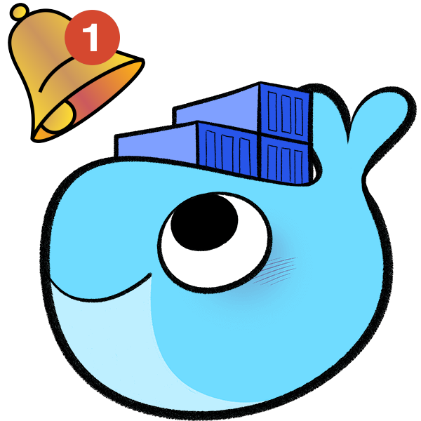
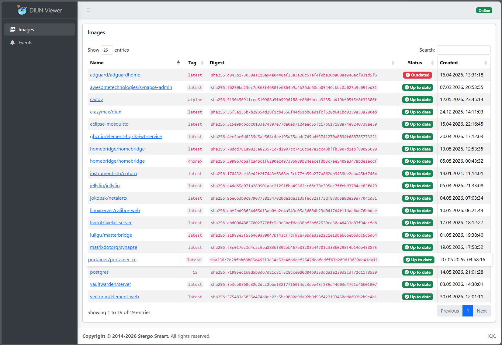
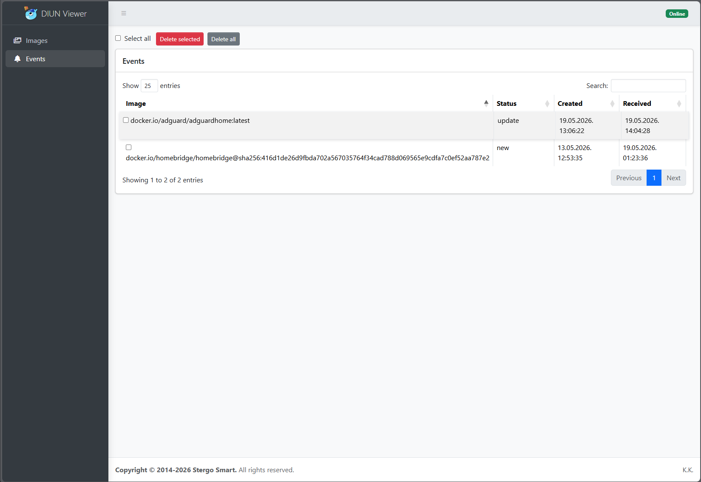
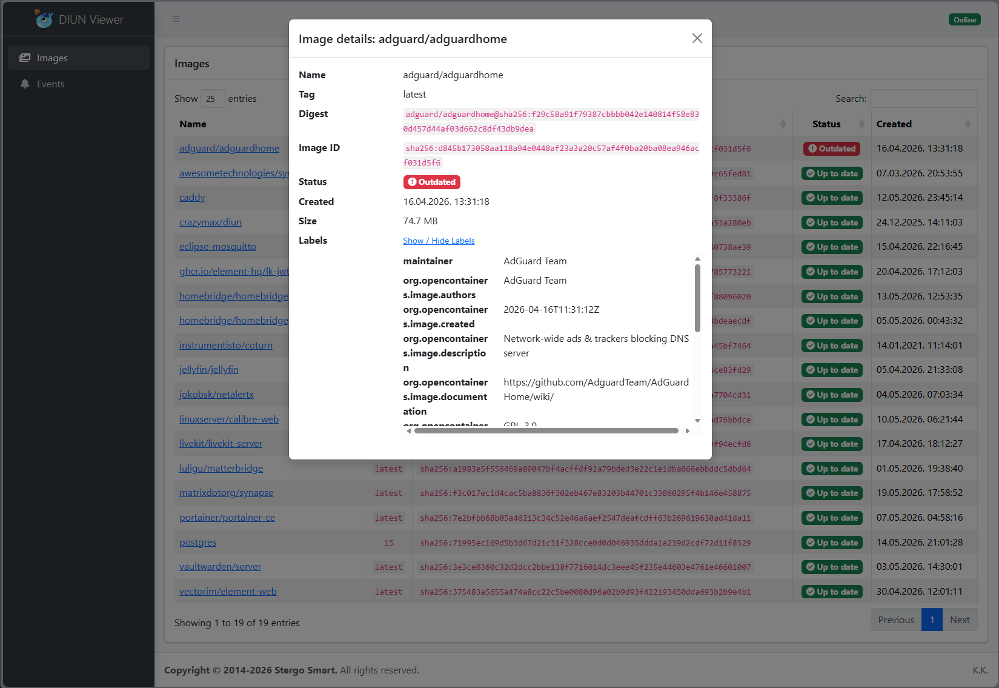

#  DIUN Viewer

DIUN Viewer is a lightweight web dashboard for [**DIUN (Docker Image Update Notifier)**](https://github.com/crazy-max/diun).
It compares your local Docker image list with the DIUN‑reported image list, highlights digest differences, and shows which images have updates available.
Incoming DIUN webhook messages are displayed as event logs, giving you a clear history of update notifications.

---

## Features

- Web UI for DIUN images and events
- Status badge per image (up to date / outdated)
- Persistent event storage in a JSON file
- DIUN webhook ingestion
- Automatic cleanup of obsolete events based on current digests
- Auto‑refresh of data every few minutes
- No external database, no build step, no heavy frameworks

---

## Architecture

- **Backend:** Go HTTP server
  - Serves static frontend
  - Uses Docker SDK (`ImageList`) to list local Docker images
  - Uses Diun image list -raw to list Diun image list
  - Receives DIUN webhook events
  - Stores events in `events.json`
  - Exposes a small JSON REST API (`/api/images`, `/api/events`, etc.)


- **Frontend:** Static HTML + JS
  - Bootstrap 5 + AdminLTE 4 layout
  - jQuery + DataTables for tables
  - FontAwesome + Bootstrap Icons for icons
  - Vanilla JS (`app.js`) for logic

High‑level flow:

1. DIUN sends webhook events to `/api/diun-webhook`
2. Go server appends events to `events.json`
3. Frontend calls `/api/events` , `/api/images` and `/api/diunImages`
4. Frontend correlates Docker image with Diun Images and renders status badges

---

## Backend

### API Endpoints

- `GET /api/images`  
  Returns Docker SDK (`ImageList`) to list local Docker images.

- `GET /api/diunImages`  
  Returns Diun images by diun image list -raw .

- `GET /api/events`  
  Returns stored events after cleaning out entries whose digest is no longer present in DIUN’s current image list.

- `POST /api/events/delete`  
  Deletes events:
  - Empty array `[]` → delete all events
  - Array of IDs `[1, 2, 3]` → delete only those events

- `POST /api/diun-webhook`  
  Receives DIUN webhook JSON and appends it to the event store.

### Configuration

The server reads a simple key/value config file diunViewer.cfg, for example:

```ini
PUBLIC_DIR=/tools/public
LISTEN_PORT=80
EVENTS_FILE=/data/events.json
DIUN_BINARY=diun
LOG_LEVEL=debug
```

## Configuration Keys

- **PUBLIC_DIR** – directory containing static frontend files  
- **LISTEN_PORT** – port for the HTTP server (e.g. `80`)  
- **EVENTS_FILE** – path to the JSON file used to persist events  
- **DIUN_BINARY** – path or name of the DIUN binary  
- **LOG_LEVEL** – `info` or `debug`  

---

## Frontend

### Technologies

- **Bootstrap 5** – layout and components  
- **AdminLTE 4** – sidebar and dashboard styling  
- **jQuery 3.6** – DOM helpers  
- **DataTables 1.13** – sortable/searchable tables  
- **FontAwesome 5** and **Bootstrap Icons** – icons  
- **Vanilla JavaScript** – application logic (`app.js`)  

---

## Installation

### Build and run (Go)

```bash
go build -o diunViewer
./diunViewer
```

Ensure:

- The config file (e.g. `/tools/diunViewer.cfg`) exists and is valid  
- `PUBLIC_DIR` points to the directory containing `index.html`, `app.js`, CSS, etc.  
- `DIUN_BINARY` is reachable (in PATH or full path)  

## DIUN Webhook Configuration
webhook only if you want to have it in Diun Viewer
```
- DIUN_NOTIF_WEBHOOK_ENDPOINT=http://192.168.1.26/api/diun-webhook
- DIUN_NOTIF_WEBHOOK_METHOD=POST
- DIUN_NOTIF_WEBHOOK_TIMEOUT=10s
```

## Docker Example

```yaml
services:
  diun:
    image: crazymax/diun:latest
    container_name: diun
    restart: always

    networks:
      qnet-static-eth0-79e6cc:
        ipv4_address: 192.168.1.26

    mac_address: 02:42:17:48:85:49

    volumes:
      - /share/Container/Diun/data:/data
      - /var/run/docker.sock:/var/run/docker.sock
      - /share/Container/Diun/tools:/tools

    ports:
      - "80:80"

    dns:
      - 192.168.1.53
      - 8.8.8.8

    environment:
      - TZ=Europe/Zagreb
      - DIUN_PROVIDERS_DOCKER=true
      - DIUN_PROVIDERS_DOCKER_WATCHBYDEFAULT=true
      - DIUN_PROVIDERS_DOCKER_WATCHSTOPPED=true
      - DIUN_WATCH_SCHEDULE=0 */6 * * *
      - DIUN_NOTIF_WEBHOOK_ENDPOINT=http://192.168.1.26/api/diun-webhook
      - DIUN_NOTIF_WEBHOOK_METHOD=POST
      - DIUN_NOTIF_WEBHOOK_TIMEOUT=10s

    entrypoint: ["/tools/entrypoint.sh"]

networks:
  qnet-static-eth0-79e6cc:
    external: true
```


## Injecting DIUN Viewer Into the DIUN Docker Image

DIUN Viewer is not baked into the `crazymax/diun` image.  
Instead, it is injected at runtime using a bind-mounted `/tools` directory and a custom `entrypoint.sh`.

This approach allows the DIUN container to be updated freely while keeping:

- The DIUN Viewer binary
- The configuration file
- The event storage
- The custom entrypoint script

fully persistent and untouched.

### How It Works
  
1. A host directory is mounted into the container at `/tools`:  
  
```yaml
/share/Container/Diun/tools:/tools
```

This directory contains:

- **diunViewer** — the Go DIUN Viewer server binary  
- **diunViewer.cfg** — configuration file  
- **entrypoint.sh** — custom startup script  

The container’s entrypoint is overridden:

```yaml
entrypoint: ["/tools/entrypoint.sh"]
```
  
  
The custom entrypoint:  
- Starts the DIUN Viewer webserver in the background   
- Starts the official DIUN binary normally  

## Result

- The DIUN container runs normally.  
- DIUN Viewer runs alongside it inside the same container.  
- Updates to the DIUN image do not affect the Viewer.  
- All Viewer files remain persistent on the host.  
- No modification of the DIUN image is required.  

This method keeps the DIUN container stateless while allowing DIUN Viewer to coexist safely and survive upgrades.


## License

MIT License  
See LICENSE for details.


| Images | Events |
|--------|--------|
|  |  |

| Image Details |
|---------------|
|  |
